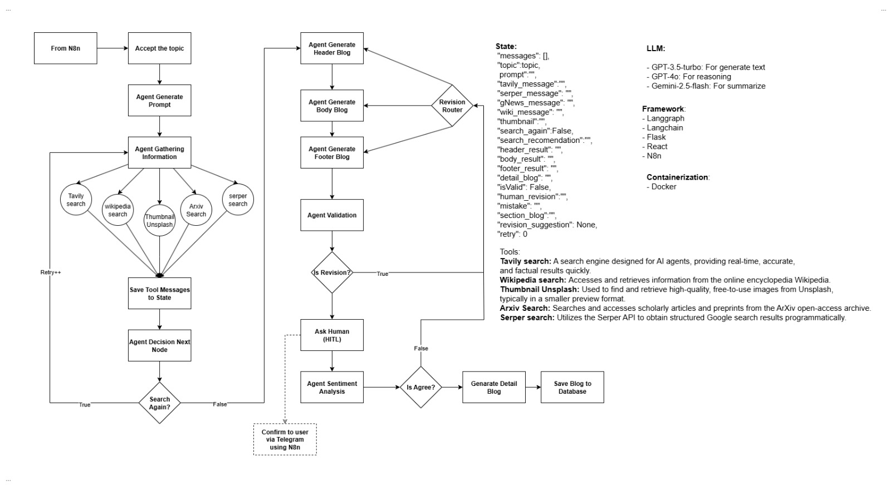
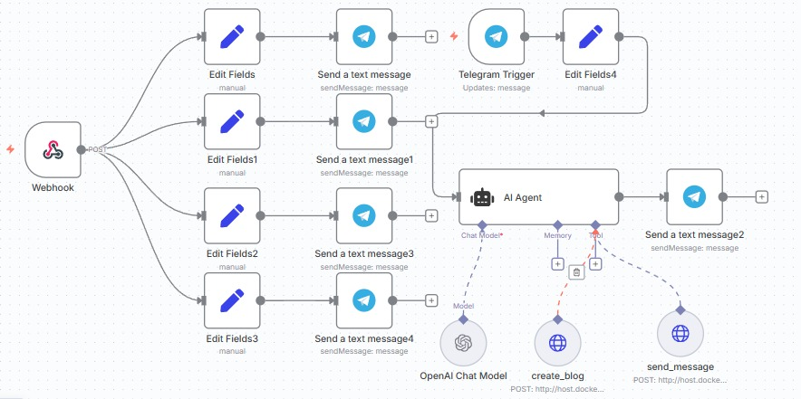

# AI Agent Web Portfolio

## Deskripsi Project

Project ini adalah web portofolio interaktif yang menampilkan halaman-halaman utama seperti **Home**, **About**, **Projects**, dan **Blog**. Keunikan utama dari project ini adalah halaman **Blog** yang sepenuhnya di-*generate* secara otomatis oleh AI Agent berbasis workflow LangGraph. Pengguna dapat mengajukan topik blog melalui Telegram, dan AI akan menghasilkan konten blog yang terstruktur, informatif, serta dapat dikonfirmasi ulang oleh user sebelum dipublikasikan.

### Arsitektur & Alur Sistem


*Gambar 1: Alur workflow AI Agent dengan LangGraph*
#### Penjelasan Workflow LangGraph

Workflow LangGraph pada sistem ini terdiri dari beberapa tahapan utama:

1. **Pengumpulan Informasi:**  
    Agen AI membangun prompt berdasarkan topik yang diberikan user, lalu mengumpulkan data dari berbagai sumber seperti Tavily search (real-time), Wikipedia, Unsplash (gambar), serta ArXiv atau Serper search (data ilmiah/Google). Semua hasil pencarian disimpan dalam _state_ workflow.

2. **Pembuatan Draft Blog:**  
    Setelah informasi terkumpul, agen membuat draft blog yang terdiri dari _header_, _body_, dan _footer_ menggunakan model LLM (misal: GPT-3.5-turbo, GPT-4o, Gemini-2.5-flash).

3. **Validasi & Konfirmasi (HITL):**  
    Draft blog yang dihasilkan dikirim ke user untuk konfirmasi (_Human in the Loop_). Jika disetujui, proses lanjut ke tahap finalisasi. Jika perlu revisi, workflow kembali ke proses revisi konten.

4. **Penyimpanan & Penyelesaian:**  
    Blog final disimpan ke database. Agen dapat melakukan pencarian ulang jika diperlukan di setiap tahap. Setelah selesai, notifikasi dikirim ke user melalui Telegram (via n8n).

Diagram workflow ini menggambarkan proses otomatis namun tetap melibatkan validasi manusia untuk memastikan kualitas konten blog.


*Gambar 2: Integrasi workflow n8n dengan Telegram dan Backend*
**Penjelasan Gambar Workflow n8n:**

Gambar workflow n8n di atas menggambarkan dua proses utama:

1. **Penerimaan dan Konfirmasi Blog:**  
    n8n menerima webhook dari backend yang berisi bagian-bagian blog (header, body, footer) hasil generasi AI LangGraph. Selanjutnya, n8n mengirimkan bagian-bagian blog tersebut ke Telegram agar pengguna dapat melakukan konfirmasi atau meminta revisi sebelum blog dipublikasikan.

2. **Perintah dan Keputusan:**  
    n8n juga menerima pesan masuk dari Telegram (melalui Telegram Trigger). Pesan ini kemudian dianalisis oleh agen AI untuk menentukan apakah pesan tersebut merupakan perintah pembuatan blog baru atau merupakan konfirmasi/lanjutan dari proses blog yang sedang berjalan.

Alur ini memastikan komunikasi dua arah antara pengguna dan AI Agent melalui Telegram, serta menjaga validasi konten sebelum blog dipublikasikan.


**Penjelasan Alur Blog Generation:**
1. **Input Topik Blog:** User mengirimkan topik blog melalui Telegram.
2. **Integrasi n8n:** n8n menerima pesan dari Telegram, lalu meneruskannya ke backend Flask.
3. **AI Agent Processing:** Backend menjalankan workflow LangGraph untuk memproses topik, melakukan reasoning, riset, dan menulis blog.
4. **Konfirmasi User:** Di tengah proses, AI mengirimkan draft blog ke Telegram untuk dikonfirmasi user (apakah sudah sesuai atau perlu revisi).
5. **Penyimpanan & Publikasi:** Jika sudah sesuai, blog disimpan ke database MySQL. Frontend React akan menampilkan blog yang sudah disetujui di halaman Blog.

### Stack & Tools
- **LangGraph:** Orkestrasi alur reasoning AI agent.
- **n8n:** Otomasi workflow, integrasi Telegram ↔ Backend.
- **Flask:** Backend API, integrasi LangGraph, ORM MySQLAlchemy.
- **MySQL:** Database untuk menyimpan data blog.
- **React:** Frontend web portofolio.

---

## Instalasi & Setup

### 1. Backend (Flask + LangGraph)

```sh
# Masuk ke folder Backend
cd Backend

# Buat virtual environment (opsional tapi direkomendasikan)
python -m venv venv
source venv/bin/activate  # Linux/Mac
venv\Scripts\activate     # Windows

# Install dependencies Python
pip install -r requirements.txt

# Atur file .env sesuai kebutuhan (lihat contoh di .env.example)

# Inisialisasi dan Migrasi Database (Flask-Migrate)

# Inisialisasi migration folder (hanya sekali saat pertama setup)
flask db init

# Generate migration script dari model
flask db migrate -m "Initial migration"

# Terapkan migration ke database
flask db upgrade
```

### 2. Frontend (React)

```sh
# Masuk ke folder Frontend
cd ../Frontend

# Install dependencies Node.js
npm install

# Jalankan development server
npm run dev
```

### 3. n8n & Telegram

- Deploy n8n (bisa via Docker, VPS, atau cloud) atau menggunakan ngrok untuk di local.
- Integrasikan n8n dengan Telegram Bot API dan backend Flask (lihat dokumentasi n8n untuk setup webhook dan workflow).
- Pastikan endpoint backend dapat diakses oleh n8n.

---

## Catatan Tambahan

- Pastikan MySQL sudah berjalan dan kredensial database sudah diatur di backend.
- Untuk produksi, gunakan environment variable yang aman dan lakukan konfigurasi HTTPS.
- Dokumentasi lebih lanjut untuk pengembangan dan deployment dapat disesuaikan dengan kebutuhan tim.
